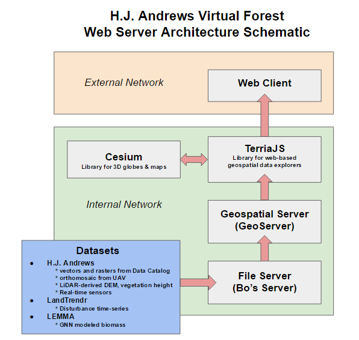
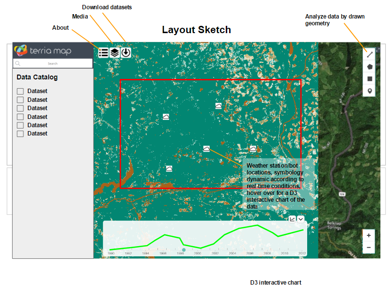
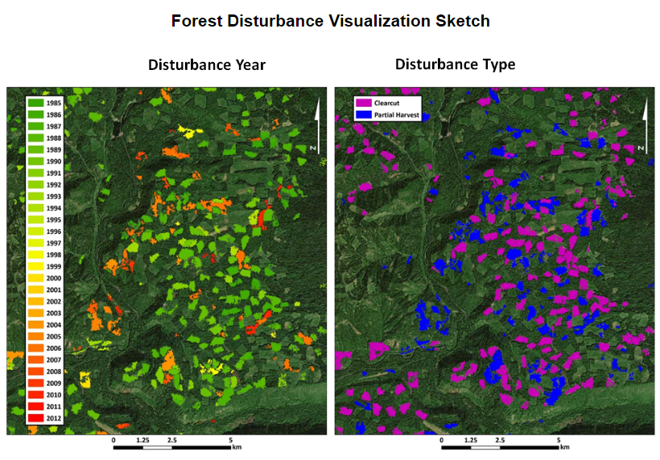

# Sketch for final Project

> Spring 2017 | Geography 472/572 | Geovisualization: Geovisual Analytics
>
> Presenter: Tyler Harris, Christopher Cosgrove and Paulo Murillo
>
> Instructor: Bo Zhao | TA: Kyle R. Hogrefe | Location: LINC 368 | Time: Tuesday/Thursday 9-9:50am

## Initial Sketch

General relationships for connecting data, services, libraries and users.

------

## **Layout**

Example for our web-services

## **Other potential visualization**

